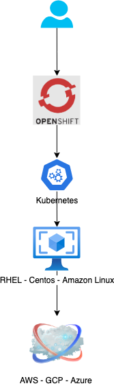

# Echemos un vistazo

## Conceptos claves

* Es un proyecto open source que actualmente se llama OKD ú Origin Community Distribution.
* Beneficios
  * Podemos definir recursos públicos o privados.
  * Incluye bare metal \(Sin sistema operativo base\) o hardware virtualizado que podría estar en una nube local o con un proveedor \(AWS, GCP, Azure, IBM, etc\).
  * El desarrollador ya no se preocupa por los despliegues, internamente openshift agrega un job y un pipeline con jenkins.

Un diagrama de arquitectura general, puede ser el siguiente:

